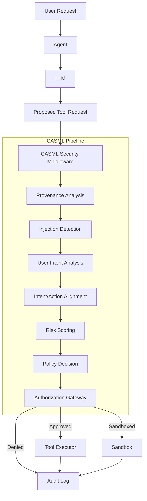

# CASML — Prototype Plan: Core Features

This document outlines the core features, architecture, and pipeline stages of the **CASML (Context-Aware Security Middleware Layer)** research prototype.

---

## 1. Project Purpose & Objectives

CASML is designed as a modular, plug-and-play security middleware layer protecting tool-using LLM agents from indirect prompt injection and unauthorized actions.

### Core Security Invariant

The most critical security invariant of the system is:
```
LLM / External Content  ✗ (Blocked)
        ↓
Direct Tool Execution
```
All privileged tool executions **must** pass through CASML.

---

## 2. Core Security Flow

When an agent proposes a tool execution, it must be evaluated by the CASML pipeline:



---

## 3. Pipeline Components (The Core Features)

Each component in the CASML pipeline acts as a modular, independent layer:

### A. Provenance Analyzer
Traces the source and trust chain of the request (`ProvenanceRecord`). It classifies whether the source is `user`, `agent`, `llm`, `tool_output`, or `external`, and checks if the prompt context has been tainted by untrusted/external content.

### B. Injection Detector
Scans the instruction context and arguments for direct or indirect prompt injection attack payloads (`DetectionResult`). It utilizes heuristic classifiers (and later, transformer-based embeddings and sequence classifiers).

### C. Intent Analyzer
Extracts and summarizes the user's original request intent (`UserIntent`), categorization, and key entities.

### D. Intent/Action Alignment Engine
Verifies whether the proposed tool action aligns with the inferred user intent (`AlignmentResult`). It flags deviations where the agent is acting autonomously beyond the scope of user commands.

### E. Risk Engine
Computes a weighted risk score (`RiskResult`) based on the outputs of the provenance, injection detection, and alignment checks, combined with static tool sensitivity weights (e.g. `email.send` is high sensitivity, `document.read` is low sensitivity).

### F. Policy Engine
Evaluates the risk score against configurable, rule-based policies (`PolicyDecision`) mapped from `configs/policies.yaml` (e.g., auto-denying critical risk, sandboxing high risk, escalating medium risk, allowing low risk).

### G. Authorization Gateway
Enforces the final decision (`AuthorizationDecision`). It blocks any executions that do not contain an approved CASML signature.

---

## 4. Execution Boundary & Sandboxing

### Tool Registry
A registry containing safe synthetic tools to support security experiments:
- **Email Tools**: `email.read`, `email.send`, `email.forward`
- **Document Tools**: `document.read`, `document.write`
- **Database Tools**: `database.read`, `database.update`
- **Web Tools**: `web.search`
- **File Tools**: `file.read`, `file.write`

### Tool Executor
Enforces that no tool can execute unless it receives a validated and authorized `SecurityDecision` with a matching `request_id`.

### Sandbox
An isolated environment that executes tools in restricted mode, filtering outputs, redacting secrets, and containing side effects.

---

## 5. Persistent Storage & Database Schema

CASML stores historical requests, decisions, and audit events using SQLAlchemy 2.x and Alembic migrations:
1. **Task**: Represents user sessions and task status.
2. **ToolDefinition**: Registered tool specifications and sensitivity levels.
3. **ToolRequest**: Record of proposed tool invocations.
4. **SecurityDecision**: Trace of the CASML evaluation.
5. **AuditEvent**: Security log events for tracking and compliance.
6. **ExperimentRun**: Configurations of run experiments.
7. **ExperimentResult**: Metrics, confusion matrices, and detailed evaluations.
8. **AttackCase**: Specific attack vectors used for validation.

---

## 6. Configurable Policies & Weights

Security thresholds and risk parameters are fully externalized in `configs/`:
- `risk.yaml`: Risk category levels, weights, and tool sensitivities.
- `policies.yaml`: Rule configurations mapping risk to actions (Allow, Deny, Sandbox, Escalate).
- `tools.yaml`: Tool definitions and parameters schemas.
- `models.yaml`: Classifier configurations, prompt templates, and LLM providers.
- `experiments.yaml` & `attacks.yaml`: Specifications for security evaluation.
